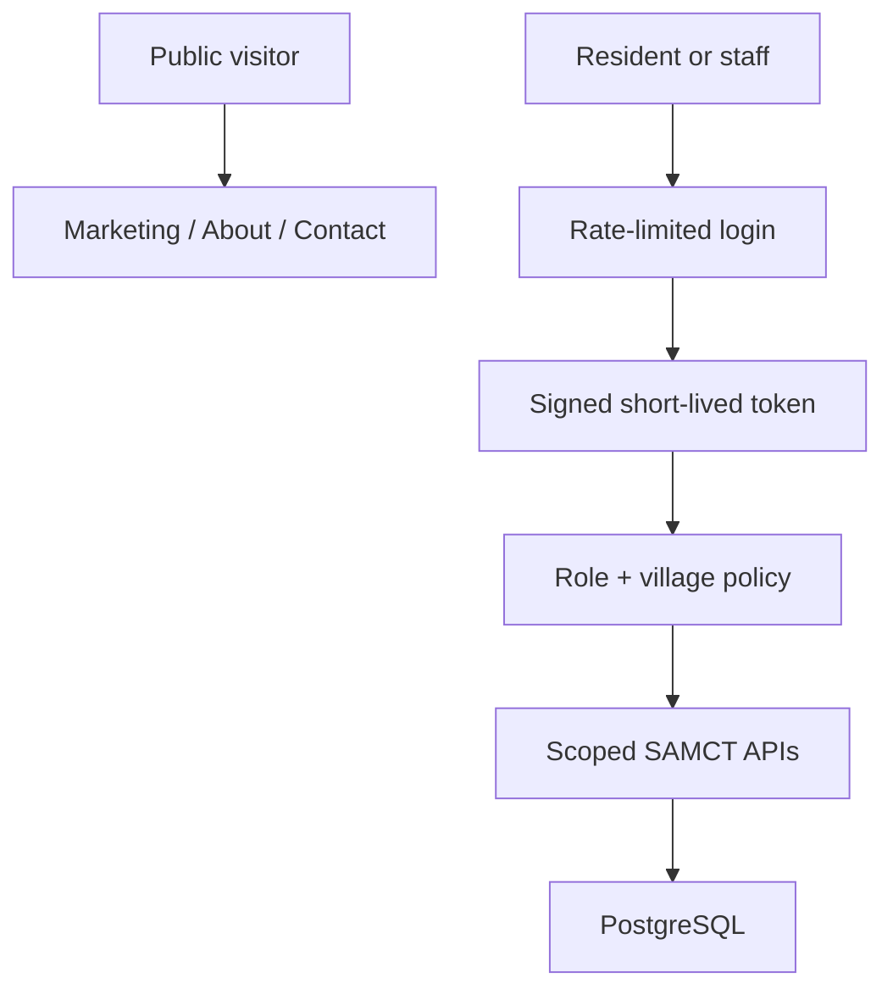

# SAMCT PortalShield

PortalShield is a security and trust upgrade for the SAMCT Villages web portal. It turns a UI-trusted prototype into a role-bound React + ASP.NET Core application with measurable authorization boundaries, safer data handling, reproducible tests, and finished public Marketing/About/SEO foundations.

This work lives on `hackathon/portalshield`. The original `main` branch is intentionally unchanged.

## The problem and user value

SAMCT residents, village managers and administrators need one portal for maintenance, documents, property information, purchase orders and account management. In the baseline, the screen looked role-aware, but the API did not authenticate callers. A person could bypass the navigation and call sensitive endpoints directly; public marketing responses also included private resident fields.

PortalShield makes the server—not browser storage—the authority. The intended outcome is simple: each person can reach only the data and actions required by their role and village, while public visitors receive only an explicit marketing-safe projection.

## What changed

- Signed, short-lived JWT access tokens with issuer, audience, signature and lifetime validation.
- Token-version invalidation after password, role, village or active-state changes; logout deny-listing.
- Admin-only registration in both API policy and React routing. There is no public self-registration.
- Role and village authorization for users, maintenance, documents, properties and purchase orders.
- Rate limits for login, password recovery and contact submissions.
- BCrypt work factor 12 and a 12-character complexity policy.
- Random, hashed, 30-minute password reset tokens with account-enumeration-safe responses.
- Explicit public marketing DTO that excludes resident PII, notes and private documents.
- Size/type allow-lists and random server filenames for uploads; private uploads require authentication.
- HSTS/HTTPS production behavior, restrictive CORS, CSP and standard security headers.
- Secrets, personal uploads and real-user seed data removed from the branch; synthetic seed provided.
- Role-bound React route guards, session-scoped access tokens and automatic `Authorization` headers.
- Completed Marketing and About experiences, accessible states, canonical metadata, robots and sitemap.
- CI gates for dependency audit, build, unit tests, secret scan and browser/API boundary tests.

## Architecture



The React route guard improves user experience, but every real security decision is repeated and enforced in ASP.NET Core. A modified browser role cannot grant API access.

## Measured improvement

The same static control evaluator runs against the competition starting commit and the final working tree:

| Version | Security controls passed | Result |
|---|---:|---:|
| Baseline `0529271` | 0 / 17 | 0% |
| PortalShield | 17 / 17 | 100% |

Run it yourself:

```bash
npm ci
npm run eval:all
```

The browser/API suite adds realistic anonymous, resident, manager and admin checks on synthetic data. See [Security evaluation](docs/SECURITY_EVALUATION.md) for scope and limitations.

## Run from a clean environment

Follow [docs/REPRODUCTION.md](docs/REPRODUCTION.md). The short version is:

```bash
cp .env.example .env.local
export POSTGRES_PASSWORD='choose-a-local-password'
docker compose up -d postgres

# Terminal 1: export the ASP.NET variables documented in .env.example
dotnet run --project server/server.csproj

# Terminal 2
npm ci
npm run dev
```

No paid AI or external API is required to run the solution, baseline, evaluation or tests. SMTP is needed only to deliver real password-reset/contact email.

## Verification commands

```bash
npm audit --audit-level=high
npm run build
dotnet build SAMCT.sln --configuration Release
dotnet test server.tests/server.tests.csproj --configuration Release
npm run eval:all
npm run test:e2e
```

CI runs these automatically on a push to `hackathon/portalshield`, a pull request to `main`, or a manual **Run workflow** action.

## Hackathon evidence

- [Improvement changelog](IMPROVEMENT_CHANGELOG.md)
- [Reproduction guide](docs/REPRODUCTION.md)
- [Security evaluation and complete results](docs/SECURITY_EVALUATION.md)
- [Representative Codex agent trajectory](docs/AGENT_TRAJECTORY.md)
- [Five-minute solution video script](docs/VIDEO_SCRIPT.md)
- [Submission checklist](HACKATHON_SUBMISSION.md)
- [Security policy and production caveats](SECURITY.md)

## Important repository-history warning

This branch removes previously tracked secrets/configuration and personal uploads from its current tree. Those objects still exist in earlier Git history and on `main`. Before any production launch, rotate every previously committed credential and perform a separately approved history rewrite (for example with `git filter-repo`), then coordinate fresh clones. PortalShield does not rewrite shared history automatically.

## Main failure mode and hot take

The baseline failure was *convincing UI security*: links changed by role, so the portal appeared protected, but API callers were anonymous and client-supplied usernames/villages were trusted. The practical lesson is that an agent should first make authority server-owned and write executable boundary checks. Generating more screens or more agents does not compensate for a missing trust boundary.
